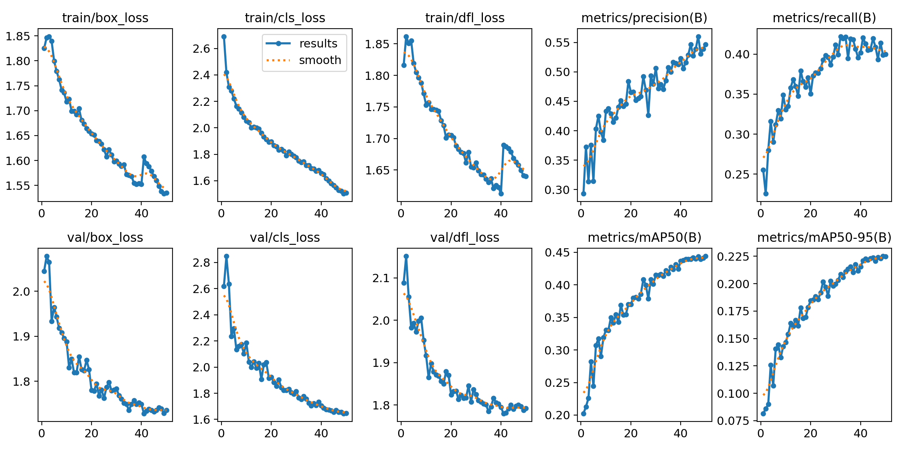

## Model Summary (Fused)
- **Layers**: 168
- **Parameters**: 3,006,233
- **Gradients**: 0
- **GFLOPs**: 8.1

## Performance by Class
| Class  | Images | Instances | Box P | R    | mAP50 | mAP50-95 |
|--------|--------|-----------|-------|------|-------|----------|
| All    | 893    | 2,315     | 0.546 | 0.399| 0.444 | 0.225    |
| Fire   | 893    | 1,291     | 0.621 | 0.62 | 0.655 | 0.354    |
| Other  | 893    | 481       | 0.403 | 0.225| 0.242 | 0.0996   |
| Smoke  | 893    | 543       | 0.613 | 0.352| 0.433 | 0.222    |
---

